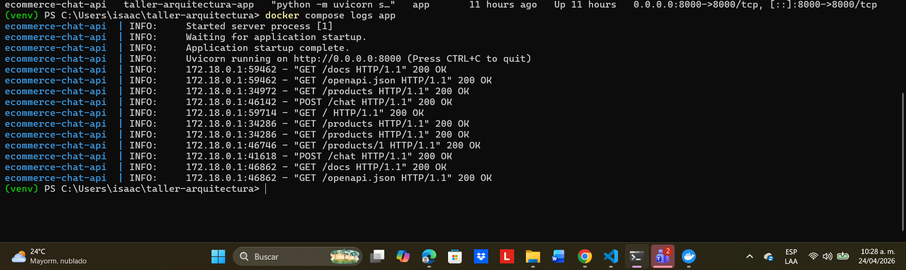

# E-commerce con Chat IA

API REST de e-commerce de zapatos con chat inteligente construida con Clean Architecture, FastAPI, SQLAlchemy, SQLite y Google Gemini.

## Descripcion

Este proyecto implementa una tienda de zapatos con dos funcionalidades principales:

- Consulta de productos mediante endpoints REST.
- Asistente conversacional con IA que recomienda productos usando el inventario disponible y el historial reciente del chat.

La aplicacion esta organizada en capas para separar dominio, aplicacion e infraestructura.

## Arquitectura

El proyecto sigue una estructura basada en Clean Architecture:

- `src/domain`: entidades, excepciones e interfaces de repositorios.
- `src/application`: DTOs y servicios de aplicacion.
- `src/infrastructure`: API FastAPI, repositorios SQLAlchemy, base de datos y proveedor Gemini.
- `tests`: pruebas unitarias y de integracion.

## Tecnologias

- Python 3.12
- FastAPI
- SQLAlchemy
- SQLite
- Google Gemini
- Docker
- Pytest
- Pytest Cov

## Requisitos previos

- Python 3.12 o superior
- Docker Desktop
- API Key de Google Gemini

## Variables de entorno

Crea un archivo `.env` a partir de `.env.example`:

```env
GEMINI_API_KEY=tu_api_key_aqui
DATABASE_URL=sqlite:///./data/ecommerce_chat.db
ENVIRONMENT=development
```

## Instalacion local

1. Clonar el repositorio

```powershell
git clone https://github.com/isaace11/taller-arquitectura.git
cd taller-arquitectura
```

2. Crear entorno virtual

```powershell
python -m venv venv
```

3. Activar entorno virtual

```powershell
.\venv\Scripts\Activate.ps1
```

4. Instalar dependencias

```powershell
python -m pip install -r requirements.txt
```

5. Configurar variables de entorno

```powershell
Copy-Item .env.example .env
```

Despues edita `.env` y agrega tu `GEMINI_API_KEY`.

## Ejecucion local

Para ejecutar la API sin Docker:

```powershell
.\venv\Scripts\python.exe -m uvicorn src.infrastructure.api.main:app --reload
```

La aplicacion quedara disponible en:

- API: `http://127.0.0.1:8000`
- Swagger UI: `http://127.0.0.1:8000/docs`
- ReDoc: `http://127.0.0.1:8000/redoc`

## Ejecucion con Docker

Construir y levantar el contenedor:

```powershell
docker compose up --build -d
```

Ver estado del contenedor:

```powershell
docker compose ps
```

Ver logs:

```powershell
docker compose logs -f
```

Detener el entorno:

```powershell
docker compose down
```

## Endpoints principales

- `GET /`
- `GET /products`
- `GET /products/{product_id}`
- `POST /chat`
- `GET /chat/history/{session_id}`
- `DELETE /chat/history/{session_id}`
- `GET /health`

## Ejemplos de uso

### Obtener productos

```powershell
Invoke-WebRequest -UseBasicParsing http://127.0.0.1:8000/products | Select-Object -ExpandProperty Content
```

### Enviar mensaje al chat

```powershell
Invoke-WebRequest `
  -UseBasicParsing `
  -Uri http://127.0.0.1:8000/chat `
  -Method POST `
  -ContentType "application/json" `
  -Body '{"session_id":"cliente-001","message":"Busco zapatos Nike para correr talla 42"}' |
  Select-Object -ExpandProperty Content
```

### Consultar historial

```powershell
Invoke-WebRequest -UseBasicParsing http://127.0.0.1:8000/chat/history/cliente-001 | Select-Object -ExpandProperty Content
```

## Pruebas

Ejecutar pruebas:

```powershell
.\venv\Scripts\python.exe -m pytest
```

Ejecutar pruebas con coverage:

```powershell
.\venv\Scripts\python.exe -m pytest --cov=src --cov-report=term-missing
```

Estado actual de pruebas:

- `38 passed`
- `83%` de coverage total

## Estructura del proyecto

```text
taller-arquitectura/
+-- data/
+-- src/
|   +-- application/
|   +-- domain/
|   +-- infrastructure/
+-- tests/
+-- .env.example
+-- Dockerfile
+-- docker-compose.yml
+-- requirements.txt
+-- evidencias/
+-- README.md
```

## Evidencias

Las capturas del taller deben guardarse en la carpeta `evidencias/` con estos nombres:

- `evidencias/01-swagger-ui.png`
- `evidencias/02-docker-logs.png`
- `evidencias/03-docker-running.png`
- `evidencias/04-api-call-products.png`
- `evidencias/05-api-call-chat.png`
- `evidencias/06-database.png`

### Checklist de evidencias

#### 1. Swagger UI

Archivo: `evidencias/01-swagger-ui.png`

Debes mostrar:

- `http://127.0.0.1:8000/docs`
- endpoints visibles
- fecha y hora del sistema

#### 2. Logs de Docker

Archivo: `evidencias/02-docker-logs.png`

Debes mostrar:

- salida de `docker compose logs`
- nombre de usuario o prompt visible
- fecha y hora del sistema

#### 3. Docker corriendo

Archivo: `evidencias/03-docker-running.png`

Debes mostrar:

- Docker Desktop con el contenedor arriba o la salida de `docker compose ps`

#### 4. Llamado a `/products`

Archivo: `evidencias/04-api-call-products.png`

Debes mostrar:

- request exitoso a `GET /products`
- lista de productos retornada

#### 5. Llamado a `/chat`

Archivo: `evidencias/05-api-call-chat.png`

Debes mostrar:

- request exitoso a `POST /chat`
- mensaje enviado
- respuesta de la IA

#### 6. Base de datos

Archivo: `evidencias/06-database.png`

Debes mostrar:

- archivo SQLite del proyecto
- tabla de productos cargada

## Comandos sugeridos para generar evidencias

### Ver logs de Docker

```powershell
docker compose logs
```

### Ver contenedor corriendo

```powershell
docker compose ps
```

### Consumir `/products`

```powershell
Invoke-WebRequest -UseBasicParsing http://127.0.0.1:8000/products | Select-Object -ExpandProperty Content
```

### Consumir `/chat`

```powershell
Invoke-WebRequest `
  -UseBasicParsing `
  -Uri http://127.0.0.1:8000/chat `
  -Method POST `
  -ContentType "application/json" `
  -Body '{"session_id":"cliente-001","message":"Busco zapatos para correr talla 42"}' |
  Select-Object -ExpandProperty Content
```

## Como completar manualmente este README

Cuando ya tengas tus capturas, puedes dejarlas dentro de `evidencias/` con los nombres pedidos y luego agregar este bloque al final del README si quieres que GitHub las muestre:

```markdown
## Evidencias visuales

### Swagger UI


### Logs de Docker


### Docker corriendo


### Llamado a products


### Llamado al chat


### Base de datos

```

Si no quieres incrustar las imagenes en el README, no pasa nada. Para el taller normalmente basta con que la carpeta `evidencias/` exista y contenga los archivos con esos nombres.

## Autor

Isaac - Universidad EAFIT
